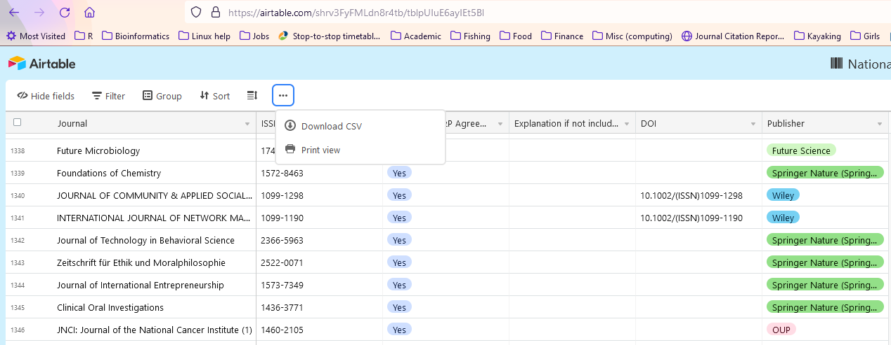

```{r setup, include=FALSE}
knitr::opts_chunk$set(echo = TRUE)
devtools::source_gist("7f63547158ecdbacf31b54a58af0d1cc", filename = "util.R")
pak::pkg_install(c("glin/reactable", "hadley/emo", "gadenbuie/tweetrmd"))
# remotes::install_github(c("glin/reactable", "hadley/emo", "gadenbuie/tweetrmd"), 
#                         INSTALL_opts = "--no-multiarch")

pacman::p_load(tidyverse, readxl, snakecase, janitor, reactable)

# define common abbreviations (that won't be converted by snakecase)
journal_abvs <- c("CA", "ICES", "BMC", "ACTA", "AAPG", "AAPS", "AATCC", "ACM", "AAS", "ACI", "AEU", "AERA", "AI", "AIAA", "AIBR", "AIDS", "AIMS", "ASTIN",
                  "AJAR", "AJIDD", "AJIL", "AKCE", "ALEA", "AMB", "AMA", "ALTEX", "ATW", "PDE", "ANZ", "AoB", "AORN", "APL", "APMIS", "ARDEA", "ARS", "ASAIO",
                  "ASCE", "ASME", "ASHRAE", "AStA", "ATLA", "AUK", "BJS", "BJU", "BMB", "BMGN", "BMJ", "BRQ", "BSGF", "CBE", "COMPEL", "COPD", "CMC",
                  "CUAJ", "CPT","CTS", "DARU", "ENT", "ESAIM", "EURE", "GAIA", "GLQ", "HAHR", "HAU", "ICHNOS", "ICON", "IEEE", "IRAL", "ISJ", "ITEA",
                  "JAAPA", "JACC", "JAIDS", "JANAC", "JARO", "JARQ", "JASSS", "JAVMA", "JAVNOST", "JCMS", "JCPSP", "JCR", "JNCI", "JNP", "JOGNN", "JPAD", 
                  "JPC","JSLS","KGK","LIBRI", "LUTS", "LWT", "MAPAN", "MCN", "MMWR", "NAUNYN", "NJAS", "NODEA", "NWIG", "ORL", "OTJR", "PFG", "QJM", "PS",
                  "QME", "RAE", "RAIRO", "RBGN", "REAL", "REDIA", "REVSTAT", "RIDE", "RILCE", "RLA", "ROFO", "RSF", "SADHANA", "SEN",  "SHILAP", "SIAM", "SJR",
                  "TOPIA", "TRAC" , "TRAMES", "UHOD", "VIAL", "ZAMM", "ZDM"
                  )
IF_table <- read_excel("data/JCR2021.xlsx", sheet = "Table 1", skip = 2) %>% 
  clean_names() %>% 
    # filter(journal_impact_factor!="Not Available") %>%
    remove_empty(which = "rows") %>%
    distinct() %>%
    mutate(journal_IF=as.numeric(journal_impact_factor),
           full_title=to_title_case(gsub("&", "and", full_journal_title, fixed = TRUE), abbreviations = journal_abvs, parsing_option=3))
# manually add IF data for journals not found in the database from https://jcr.clarivate.com/jcr/browse-journals
my_IF_table <- tribble(~full_title, ~journal_IF, # ~Publisher,
                       "Microbial Genomics", 5.237, #"Microbiology Society"
                       "Genes", 4.096, 
                       "Scientific Reports", 4.380,
                       "SpringerPlus", 1.130,
                       "Frontiers in Chemistry", 5.221,
                       "Frontiers in Plant Science", 5.754,
                       "Frontiers in Genetics", 4.599
                       )

free_journals <- read_csv("data/CAUL_agreement_all_publishers.csv", col_types = "cccccc") %>% 
  clean_names("mixed") %>% 
  mutate(full_title=gsub("Thalassas:.+", "Thalassas", Journal),
         full_title=to_title_case(gsub("&", "and", full_title, fixed = TRUE), 
                                  abbreviations = journal_abvs, parsing_option=3))

SJR_table <- read_delim("data/scimagojr 2021.csv", delim = ";") %>% 
   clean_names(case="mixed", abbreviations = c("SJR", "ISSN", "ID")) %>% 
  mutate(full_title=gsub("Thalassas:.+", "Thalassas", Title),
         full_title=to_title_case(gsub("&", "and", full_title, fixed = TRUE), 
                                  abbreviations = journal_abvs, parsing_option=3)) %>% 
  select(full_title, SJR, H_index, Categories, Publisher)

complete_IF_table <- IF_table %>% 
  select(full_title, journal_IF) %>%
  bind_rows(my_IF_table) %>%
  full_join(SJR_table) %>% 
  full_join(free_journals %>% select(-Journal),by = "full_title") %>% 
  distinct() %>% 
  mutate(Publisher=ifelse(!is.na(Publisher.x) & !is.na(Publisher.y), glue::glue("{Publisher.x}/{Publisher.y}"), 
                          ifelse(!is.na(Publisher.x) & is.na(Publisher.y),Publisher.x, Publisher.y)),
    Included_in_R_P_Agreement=replace_na(Included_in_R_P_Agreement, "No"),
         Explanation_if_not_included=if_else(Included_in_R_P_Agreement=="No" & is.na(Publisher), 
                                             "Publisher not signed an agreement with CAUL",
                                             Explanation_if_not_included)) %>% 
  select(!contains("Publisher.")) 
```

## TL;DR 

Use the following table to search for indexed scientific journals, check for their impact factor (IF) and see if they are open access (OA) and covered within the "Read and Publish" agreement for Australian and New Zealand academics.

```{r journal-table, echo=FALSE}
complete_IF_table %>% select(Journal=full_title, impact_factor_2021=journal_IF, SJR, H_index, 
                             Categories, Included_in_CAUL_Agreement=Included_in_R_P_Agreement,
                             Publisher) %>% 
  clean_names("title", abbreviations = c("ISSN", "DOI", "IF", "CAUL", "SJR")) %>% 
  reactable(columns = list(
    Journal = colDef(width = 275),   # 50% width, 200px minimum
    Categories = colDef(width = 275),
    SJR = colDef(width = 70),
    "H Index" = colDef(width = 70),
    Publisher = colDef(width = 120)
  ),
  filterable = TRUE, searchable = TRUE, resizable = TRUE, bordered = TRUE, striped = TRUE, highlight = TRUE)

```

Now for the full story:

# Academic Publishing and Open Access

In the academic world you are being measured by a very cruel metric -- your publication and citation index, which is derived from the number of scientific articles (and books) published, their impact factor (IF) and the number of times they were cited (often measured as [H-index](https://scholar.google.com/intl/en/scholar/metrics.html#metrics){target="_blank"}). These measures are closely looked at and compared when selecting candidates for research and lecturing positions and in many cases can determine a career trajectory.

A major emphasis is given in recent years to democratise scientific findings, so academics are encouraged to publish their findings in Open Access (OA) journals, bypassing the so called "paywall" and making them widely available to the public. However, publishing is such journals is often very expensive and can reach thousands of dollars, thus discriminating against students, early career researchers and scientists from low-income countries who are unable to afford it.  

## CAUL APC Agreement

A very welcomed change is coming from The Council of Australian University Librarians ([CAUL](https://caul.libguides.com/read-and-publish){target="_blank"}) consortium, who have signed a collective agreement with leading publishers to allow Australian and NZ academics to publish in selected OA journals free-of-charge `r emo::ji('smiling_face_with_smiling_eyes')`.

<!-- >The CAUL Consortium works continuously to negotiate Read & Publish (R&P) agreements, enabling libraries to support students, academics and researchers, with useful scholarly content, and providing authors the opportunity to publish open access immediately on acceptance, and free of any transactional Article Processing Charges (APCs). (<https://caul.libguides.com/read-and-publish>) -->

```{r caul-tweet, echo=FALSE}
tweetrmd::tweet_embed("https://twitter.com/CAULalert/status/1452847591125917704", 
                        hide_media=FALSE)
```

The agreement currently covers more than 5,300 entries (available as an [online table](https://airtable.com/shrv3FyFMLdn8r4tb){target="_blank"}), however, it is extremely difficult searching for a relevant journal and more than that, finding its impact factor, which as said, is a major consideration when choosing a journal to publish your hard-earned precious findings.

## Finding a Journal's Impact Factor

Despite its importance, it's not as easy as you would think finding the impact factor of a journal...  
A couple of options are the official Web of Science [Journal Citation Reports (JCR) platform](https://clarivate.com/webofsciencegroup/solutions/journal-citation-reports/){target="_blank"}, but this service requires registering a user account and logging in (you can use your ANZ University credentials using AAF). In addition this service doesn't allow for batch searching and downloading and again makes the task of finding a relevant Open Access journal's IF very time consuming and laborious. 

Other websites took a step forward and compiled a list of these journals and their IF from the official JCR website and made them available for download in Excel format (in [impactfactorforjournal.com](https://impactfactorforjournal.com/jcr-2021/){target="_blank"}) or as a PDF document ([phdtalk.org](https://phdtalks.org/2021/05/download-scie-journal-list-latest.html){target="_blank"}), which makes searching through the tables much easier. Furthermore, phdtalk.org have developed an online tool ([journalfinder.phdtalks.org](https://journalfinder.phdtalks.org/){target="_blank"}) for searching indexed and OA journals by keywords and/or category, but still, this useful tool does not provide IF for the journals it finds.

Another useful source for journal ranking is the [Scimago Journal Ranking](https://www.scimagojr.com/journalrank.php?page=1&total_size=27339){target="_blank"} (SJR), which provides a searchable (and downloadable!) table of journals, with their SJR ranking, H-index and the journal's ranking in the discipline/category (Q1/2/3/4).

## Searchable Open Access Journal Impact Factor Table

This is where my R and Rmarkdown skills come handy!  
I used a handful of very useful packages for this work: 

* [pacman](https://github.com/trinker/pacman){target="_blank"}, which provides a one-liner command to load/install packages and even supports NSE (no need to quote the package names, tidyverse-style).  
* `tidyverse` for general data wrangling and `readxl` (which is actually a part of the tidyverse) to read data from Excel sheets.  
* [snakecase](https://tazinho.github.io/snakecase/){target="_blank"} to consistently convert strings (journal titles) to facilitate merging of the different tables.  
* [janitor](https://garthtarr.github.io/meatR/janitor.html){target="_blank"}, which has a lot of useful functions for cleaning and tidying datasets. 

```{r packages, eval=FALSE}
# load required packages (using pacman package)
library(pacman)
p_load(tidyverse, readxl, snakecase, janitor, glue)
```

The following code snippets describe how I compiled a searchable IF table for OA journals covered by the CAUL agreement by combining the available tables from CAUL (OA journals) and JCR (IF table). The pre-compiled IF table was downloaded from [impactfactorforjournal.com](https://impactfactorforjournal.com/jcr-2021/){target="_blank"} (scroll to the very bottom of the page or use this direct download link [JCR2021.xlsx](https://impactfactorforjournal.com/wp-content/uploads/2021/07/JCR2021.xlsx){target="_blank"}).   

The data table was read from the Excel sheet and cleaned by skipping the 2 first rows in `Table 1` worksheet (`Table 2` worksheets can be added, but it doesn't contribute much with 9 more entries which don't have an IF anyway). The data was further processed with various functions from `janitor` package to "normalise" headers (lower caps, with underscores to replace spaces) and journal titles (convert all to "Title Case" while keeping common abbreviations intact and replace '&' with 'and'). Details of additional journals (that I publish at) were added to the data based on individual search at CJR (feel free to add additional journals that you feel are missing from the dataset).

```{r if-table, warning=FALSE, eval=FALSE}
# define common abbreviations (that won't be converted by snakecase)
journal_abvs <- c("CA", "ICES", "BMC", "ACTA", "AAPG", "AAPS", "AATCC", "ACM", "AAS", "ACI", "AEU", "AERA", "AI", "AIAA", "AIBR", "AIDS", "AIMS", "ASTIN",
                  "AJAR", "AJIDD", "AJIL", "AKCE", "ALEA", "AMB", "AMA", "ALTEX", "ATW", "PDE", "ANZ", "AoB", "AORN", "APL", "APMIS", "ARDEA", "ARS", "ASAIO",
                  "ASCE", "ASME", "ASHRAE", "AStA", "ATLA", "AUK", "BJS", "BJU", "BMB", "BMGN", "BMJ", "BRQ", "BSGF", "CBE", "COMPEL", "COPD", "CMC",
                  "CUAJ", "CPT","CTS", "DARU", "ENT", "ESAIM", "EURE", "GAIA", "GLQ", "HAHR", "HAU", "ICHNOS", "ICON", "IEEE", "IRAL", "ISJ", "ITEA",
                  "JAAPA", "JACC", "JAIDS", "JANAC", "JARO", "JARQ", "JASSS", "JAVMA", "JAVNOST", "JCMS", "JCPSP", "JCR", "JNCI", "JNP", "JOGNN", "JPAD", 
                  "JPC","JSLS","KGK","LIBRI", "LUTS", "LWT", "MAPAN", "MCN", "MMWR", "NAUNYN", "NJAS", "NODEA", "NWIG", "ORL", "OTJR", "PFG", "QJM", "PS",
                  "QME", "RAE", "RAIRO", "RBGN", "REAL", "REDIA", "REVSTAT", "RIDE", "RILCE", "RLA", "ROFO", "RSF", "SADHANA", "SEN",  "SHILAP", "SIAM",
                  "TOPIA", "TRAC" , "TRAMES", "UHOD", "VIAL", "ZAMM", "ZDM"
                  )
# manually add IF data for journals not found in the database from https://jcr.clarivate.com/jcr/browse-journals
my_IF_table <- tribble(~full_title, ~journal_IF, # ~Publisher,
                       "Microbial Genomics", 5.237, #"Microbiology Society"
                       "Genes", 4.096, 
                       "Scientific Reports", 4.380,
                       "SpringerPlus", 1.130,
                       "Frontiers in Chemistry", 5.221,
                       "Frontiers in Plant Science", 5.754,
                       "Frontiers in Genetics", 4.599
                       )

IF_table <- read_excel("data/JCR2021.xlsx", sheet = "Table 1", skip = 2) %>% 
  clean_names() %>% 
    # filter(journal_impact_factor!="Not Available") %>%
    remove_empty(which = "rows") %>%
    distinct() %>%
    mutate(journal_IF=as.numeric(journal_impact_factor),
           full_title=to_title_case(gsub("&", "and", full_journal_title, fixed = TRUE), 
                                    abbreviations = journal_abvs, parsing_option=3)) %>% 
  bind_rows(my_IF_table)

```

The SJR table was downloaded from the [Scimago Journal Ranking](https://www.scimagojr.com/journalrank.php?page=1&total_size=27339){target="_blank"} website, processed in a similar way to the JCR table and the 2 tables were combined based on the journal title.

```{r sjr-table, eval=FALSE}
SJR_table <- read_delim("data/scimagojr 2021.csv", delim = ";") %>% 
   clean_names(case="mixed", abbreviations = c("SJR", "ISSN", "ID")) %>% 
  mutate(full_title=gsub("Thalassas:.+", "Thalassas", Title),
         full_title=to_title_case(gsub("&", "and", full_title, fixed = TRUE), 
                                  abbreviations = journal_abvs, parsing_option=3)) %>% 
  select(full_title, SJR, H_index, Categories, Publisher)
```

The table of OA journals covered under the CAUL agreement was downloaded from [Airtable](https://airtable.com/shrv3FyFMLdn8r4tb){target="_blank"} and saved as `csv` file (see \@ref(fig:caul-airtable)) 

```{r caul-airtable, echo=FALSE, out.width="90%", fig.cap="Downloading the complete table of OA journals under the CAUL agreement from Airtable"}

```

The table was imported to R and processed in a similar way to the IF data, to try and achieve consistent journal names that could be joined.

```{r oa-data, eval=FALSE}
free_journals <- read_csv("data/CAUL_agreement_all_publishers.csv", col_types = "cccccc") %>% 
  clean_names("mixed") %>% 
  mutate(full_title=gsub("Thalassas:.+", "Thalassas", Journal),
         full_title=to_title_case(gsub("&", "and", full_title, fixed = TRUE), 
                                  abbreviations = journal_abvs, parsing_option=3))
```

Then, all 3 tables were joined.

```{r join-tables, eval=FALSE}
complete_IF_table <- IF_table %>% 
  select(full_title, journal_IF) %>%
  full_join(SJR_table) %>% 
  full_join(free_journals %>% select(-Journal),by = "full_title") %>% 
  distinct() %>% 
  mutate(Publisher=ifelse(!is.na(Publisher.x) & !is.na(Publisher.y), glue("{Publisher.x}/{Publisher.y}"), 
                          ifelse(!is.na(Publisher.x) & is.na(Publisher.y),Publisher.x, Publisher.y)),
    Included_in_R_P_Agreement=replace_na(Included_in_R_P_Agreement, "No"),
         Explanation_if_not_included=if_else(Included_in_R_P_Agreement=="No" & is.na(Publisher), 
                                             "Publisher not signed an agreement with CAUL",
                                             Explanation_if_not_included)) %>% 
  select(!contains("Publisher."))  
```

The resulting table can be presented in Shiny or Rmarkdown with the [DT](https://rstudio.github.io/DT/){target="_blank"} or [reactable](https://glin.github.io/reactable/index.html){target="_blank"} packages.

```{r final-table}
complete_IF_table %>% select(Journal=full_title, impact_factor_2021=journal_IF, SJR, H_index, 
                             Categories, Included_in_CAUL_Agreement=Included_in_R_P_Agreement,
                             Publisher, Doi) %>% 
  clean_names("title", abbreviations = c("ISSN", "DOI", "IF", "CAUL", "SJR")) %>% 
  reactable(columns = list(
    Journal = colDef(width = 275),   # 50% width, 200px minimum
    Categories = colDef(width = 275),
    SJR = colDef(width = 70),
    "H Index" = colDef(width = 70),
    Publisher = colDef(width = 120)
  ),
  filterable = TRUE, searchable = TRUE, resizable = TRUE, bordered = TRUE, striped = TRUE, highlight = TRUE)
```
